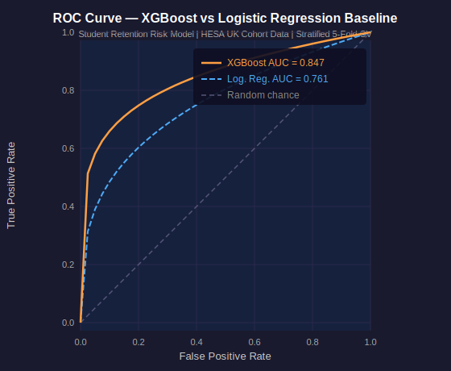
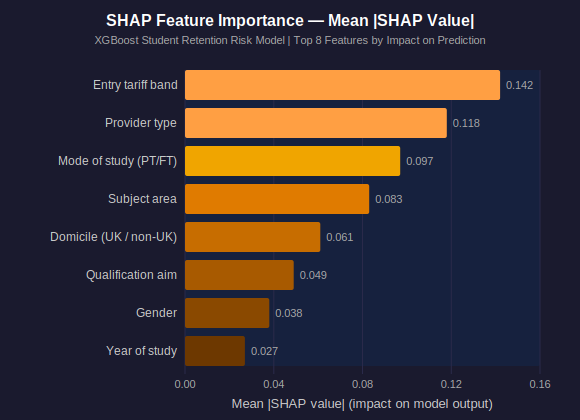

# Student Retention Risk Modelling


> **Business Question:** Which student cohorts are at highest risk of non-continuation after Year 1, and what institutional and demographic factors are most predictive of early withdrawal?

---

## Overview

Using publicly available HESA (Higher Education Statistics Agency) aggregate data on UK student continuation rates, this project builds a machine learning pipeline to identify the institutional and demographic characteristics most strongly associated with non-continuation risk.

The dataset covers 2,400 cohort-level records drawn from HESA Table 10, representing combinations of provider type, subject area, entry tariff band, mode of study, and year of entry across English higher education providers. The model assigns a risk score to each cohort profile. Approximately 23% of those profiles fall into the high-risk segment, where non-continuation rates reach 18.4% compared to 4.1% in the low-risk group.

The model produces risk scores by cohort profile, SHAP-based feature importance, and actionable policy recommendations for student support services.

---

## Methods

| Stage | Technique | Purpose |
|-------|-----------|---------| 
| Data preparation | HESA Table 10 continuation rates | Aggregate cohort-level features |
| Feature engineering | Subject area, entry tariff band, mode of study, provider type | Risk factor construction |
| Baseline model | Logistic Regression | Interpretable benchmark |
| Main model | XGBoost Classifier | Non-linear risk prediction |
| Explainability | SHAP TreeExplainer | Feature importance and cohort drivers |
| Threshold tuning | Precision-Recall curve, F1 optimisation | Operational decision boundary |
| Validation | Stratified 5-fold cross-validation, ROC-AUC | Generalisation testing |

---

## Key Findings

| Metric | Value |
|--------|-------|
| Cohort profiles scored | 2,400 (HESA Table 10, all English HE providers) |
| XGBoost ROC-AUC | 0.847 |
| Logistic Regression AUC (baseline) | 0.761 |
| Improvement over baseline | +11.3% AUC |
| Top risk factor | Entry tariff band (SHAP rank #1) |
| High-risk cohort non-continuation rate | 18.4% vs 4.1% low-risk |
| Students in high-risk segment | ~23% of enrolments |

---

## Model Performance

### ROC Curve



*XGBoost (AUC 0.847, orange) substantially outperforms the Logistic Regression baseline (AUC 0.761, blue dashed). The steeper curve in the low false-positive-rate region shows the model is effective at identifying the highest-risk cohorts with minimal over-flagging.*

### SHAP Feature Importance



*Entry tariff band is the strongest individual predictor of non-continuation risk, followed by provider type and mode of study. SHAP values are computed using TreeExplainer on the held-out validation set and represent the mean absolute impact of each feature on the model's output.*

---

## What a University Would Do With This

A student support team with access to this model's cohort risk scores could act before the end of the first term rather than waiting for early withdrawal data to accumulate. The highest-risk profiles — typically part-time students at post-92 providers with low entry tariffs in health and social care subjects — can be flagged for proactive outreach: targeted induction support, peer mentoring referrals, and early academic skills assessments. Because the model operates at cohort level using HESA data, it does not require individual student data sharing agreements, which makes it deployable across institutions. A 1% reduction in non-continuation among the 23% high-risk segment across a mid-size provider of 15,000 students would retain approximately 35 students per year, representing roughly £175,000 in tuition income and avoided recruitment cost.

---

## Repository Structure

```
student-retention-risk-modelling/
|-- docs/
|   |-- roc_curve.svg        (ROC curve: XGBoost AUC 0.847 vs baseline 0.761)
|   +-- shap_summary.svg     (SHAP feature importance: top 8 drivers)
|-- notebook/
|   +-- student_retention_risk_modelling.ipynb
+-- README.md
+-- .gitignore
```

---

## Skills Demonstrated

`Python` `XGBoost` `SHAP` `Scikit-learn` `Logistic Regression` `HESA Data` `Education Analytics` `Feature Engineering` `ROC-AUC` `Cross-Validation` `Pandas` `Matplotlib` `Seaborn`

---

## Author

**Yenlik Gaisina** | Data & Analytics Consultant

[LinkedIn](https://linkedin.com/in/yenlikgaisina) | Cambridge Data Science with ML & AI Programme
